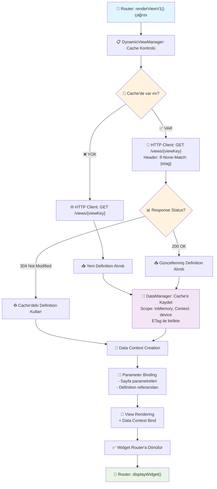

# DynamicViewManager

> **Not:** Bu dokümantasyon hem TypeScript (web) hem de Flutter (mobil) platformlarında kullanılacak core SDK için generic bir yaklaşım sunar. Platform-specific implementasyonlar (Vue/React component'ları veya Flutter widget'ları) adapter katmanında gerçekleştirilir.

DynamicViewManager, backend'den gelen dynamic view definition'larının client-side rendering ve lifecycle yönetimini sağlayan core SDK sınıfıdır.

## 🎯 Temel Amaç

Backend tarafından tanımlanan ve Navigation System üzerinden gelen dynamic view'ların UI component'larına dönüştürülmesi, render edilmesi ve yaşam döngüsü yönetimini sağlamak. Navigation'da `"type": "dynamicView"` olarak tanımlanmış öğelerin client-side implementasyonunu gerçekleştirir.

## 🚀 Temel Sunduğu Hizmetler

* **Dynamic Rendering**: Backend'den gelen JSON view definition'larının UI component'larına dönüştürülmesi
* **Version Management**: v1 ve v2 dynamic view format'larının desteklenmesi  
* **Component Lifecycle**: Dynamic component'ların yaşam döngüsü yönetimi (create, update, destroy)
* **View Caching**: DataManager ile ETag-based cache yönetimi (her zaman sunucuya sorulur, 304 Not Modified durumunda cache kullanılır)
* **Data Binding**: View component'larının DataManager ile entegrasyonu ve data promotion
* **Configuration Management**: Backend'den gelen config parametrelerinin yönetimi
* **Error Handling**: View render hatalarının yönetimi ve fallback mekanizmaları

## 🔄 **DynamicViewManager Lifecycle Flow**

Render talebi geldiğinde DynamicViewManager gerekli adımları işleyerek görünümü router için hazırlar:



### **Lifecycle Adımları:**

1. **Cache Kontrolü**: DataManager'dan ilgili sayfanın definition bilgisi ve ETag değeri kontrol edilir
2. **HTTP Request**: 
   - Cache'de yoksa: HTTP client ile sayfayı ister
   - Cache'de varsa: ETag değerini `If-None-Match` header'ı ile gönderir
3. **Cache Update**: 
   - HTTP 304 Not Modified: Cache'deki definition kullanılır
   - HTTP 200 OK: Yeni definition ve ETag DataManager'a kaydedilir
4. **Data Context Creation**: Sayfa örneği için özel bir data context yaratır
5. **Parameter Binding**: Data context içerisine sayfa parametreleri ve definition'daki tanımlı veri referanslarını ekler
6. **Rendering**: Sayfayı render ederek data context'i bind eder

```typescript
// TypeScript (Web)
// DynamicViewManager işlem akışı
const cacheKey = `view-definition/${viewKey}`;
const cachedData = await dataManager.get({
  scope: DataScope.inMemory,
  context: DataContext.device,
  key: cacheKey
});

let definition: ViewDefinition;
let etag: string | undefined;

if (cachedData) {
  // Cache'de var, ETag ile kontrol et
  etag = cachedData.etag;
  const response = await apiClient.get(`/views/${viewKey}`, {
    headers: etag ? { 'If-None-Match': etag } : {}
  });
  
  if (response.status === 304) {
    // Değişiklik yok, cache'deki kullan
    definition = cachedData.definition;
  } else {
    // Yeni versiyon geldi
    definition = response.data;
    etag = response.headers['etag'];
    await dataManager.set({
      scope: DataScope.inMemory,
      context: DataContext.device,
      key: cacheKey,
      value: { definition, etag }
    });
  }
} else {
  // Cache'de yok, yeni istek
  const response = await apiClient.get(`/views/${viewKey}`);
  definition = response.data;
  etag = response.headers['etag'];
  await dataManager.set({
    scope: DataScope.inMemory,
    context: DataContext.device,
    key: cacheKey,
    value: { definition, etag }
  });
}
```

```dart
// Dart (Flutter)
// DynamicViewManager işlem akışı
final cacheKey = 'view-definition/$viewKey';
final cachedData = await dataManager.getData(
  DataScope.inMemory,
  DataContext.device,
  cacheKey
);

ViewDefinition definition;
String? etag;

if (cachedData != null) {
  // Cache'de var, ETag ile kontrol et
  etag = cachedData['etag'] as String?;
  final response = await httpClient.get(
    '/views/$viewKey',
    headers: etag != null ? {'If-None-Match': etag} : {}
  );
  
  if (response.statusCode == 304) {
    // Değişiklik yok, cache'deki kullan
    definition = cachedData['definition'] as ViewDefinition;
  } else {
    // Yeni versiyon geldi
    definition = ViewDefinition.fromJson(response.data);
    etag = response.headers['etag'];
    await dataManager.setData(
      DataScope.inMemory,
      DataContext.device,
      cacheKey,
      {'definition': definition, 'etag': etag}
    );
  }
} else {
  // Cache'de yok, yeni istek
  final response = await httpClient.get('/views/$viewKey');
  definition = ViewDefinition.fromJson(response.data);
  etag = response.headers['etag'];
  await dataManager.setData(
    DataScope.inMemory,
    DataContext.device,
    cacheKey,
    {'definition': definition, 'etag': etag}
  );
}
```

## 📍 Dynamic View Versions

### **Version v1 Format**
```json
{
  "type": "dynamicView",
  "version": "v1",
  "key": "profile-v1",
  "config": {
    "view": "display-profile",
    "version": "1.1"
  }
}
```

### **Version v2 Format**
```json
{
  "type": "dynamicView", 
  "version": "v2",
  "key": "profile-v2",
  "config": {
    "key": "display-profile",
    "domain": "IDM", 
    "version": "1.1",
    "flow": "view"
  }
}
```

## 👥 Tüketiciler

* **Router**: Dynamic view navigation isteklerini DynamicViewManager'a yönlendirir
* **Navigation System**: Backend'den gelen dynamic view definition'larını sağlar
* **DataManager**: View'larda kullanılacak data binding, promotion ve ETag-based cache yönetimi
* **UI Components**: Render edilen dynamic component'ları consume eder (Vue/React component'ları veya Flutter widget'ları)

## 💡 Kullanım Senaryoları

### **Navigation-Triggered Dynamic View Rendering Senaryosu**

Router'dan gelen navigation isteği sonrası dynamic view render edilir:

```typescript
// TypeScript (Web)
// v2 Dynamic View Rendering
const component = await dynamicViewManager.renderViewV2({
  key: "display-profile",
  domain: "IDM",
  version: "1.1",
  flow: "view",
  parameters: {
    userId: 'user123',
    theme: 'dark'
  }
});

// v1 Dynamic View Rendering (Legacy Support)
const legacyComponent = await dynamicViewManager.renderViewV1({
  view: "display-profile",
  version: "1.1",
  parameters: {
    userId: 'user123'
  }
});
```

```dart
// Dart (Flutter)
// v2 Dynamic View Rendering
final widget = await dynamicViewManager.renderViewV2(
  key: "display-profile",
  domain: "IDM",
  version: "1.1",
  flow: "view",
  parameters: {
    'userId': 'user123',
    'theme': 'dark'
  }
);

// v1 Dynamic View Rendering (Legacy Support)
final legacyWidget = await dynamicViewManager.renderViewV1(
  view: "display-profile",
  version: "1.1",
  parameters: {
    'userId': 'user123'
  }
);
```

### **Data Promotion ile Dynamic View Senaryosu**

Navigation'dan gelen data promotion ile view render edilir:

```dart
// Navigation'da tanımlanmış data promotion
final navigationData = [
  {
    "type": "static",
    "promoteAs": "sourceAccount", 
    "value": "TR123456789012345678901234"
  },
  {
    "type": "dataManager",
    "promoteAs": "lastTransactionDate",
    "context": "device",
    "scope": "inMemory", 
    "key": "account/{{@accountNo}}",
    "path": "account.lastTransaction.date"
  }
];

// DynamicViewManager data promotion'ı process eder
await dynamicViewManager.processDataPromotion(
  viewId: 'profile-view-123',
  promotionData: navigationData
);
```

### **View Caching Senaryosu (ETag-Based)**

View'lar DataManager ile ETag-based cache'lenir. Her zaman sunucuya sorulur, 304 Not Modified durumunda cache kullanılır:

```typescript
// TypeScript (Web)
// View render - otomatik ETag cache yönetimi
const component = await dynamicViewManager.renderViewV2({
  key: "display-profile",
  domain: "IDM",
  version: "1.1",
  flow: "view",
  parameters: {
    userId: 'user123'
  }
});
// DynamicViewManager otomatik olarak:
// 1. DataManager'dan cache kontrol eder
// 2. ETag ile sunucuya sorar
// 3. 304 ise cache kullanır, 200 ise günceller
```

```dart
// Dart (Flutter)
// View render - otomatik ETag cache yönetimi
final widget = await dynamicViewManager.renderViewV2(
  key: "display-profile",
  domain: "IDM",
  version: "1.1",
  flow: "view",
  parameters: {
    'userId': 'user123'
  }
);
// DynamicViewManager otomatik olarak:
// 1. DataManager'dan cache kontrol eder
// 2. ETag ile sunucuya sorar
// 3. 304 ise cache kullanır, 200 ise günceller
```

### **View Update Senaryosu**

Mevcut view'ın parametreleri güncellenir:

```dart
// DataManager'dan gelen data değişikliği sonrası view güncelle
dataManager.observe('user/profile').listen((data) async {
  await dynamicViewManager.updateView(
    viewId: 'profile-view-123',
    parameters: {
      'userName': data['name'],
      'email': data['email'],
      'lastLoginDate': data['lastLogin']
    }
  );
});
```

### **Error Handling Senaryosu**

View render hatası durumunda fallback mekanizması:

```dart
// v2 Error Handling
try {
  final widget = await dynamicViewManager.renderViewV2(
    key: "display-profile",
    domain: "IDM",
    version: "1.1", 
    flow: "view",
    parameters: {
      'userId': 'user123'
    }
  );
  return widget;
} catch (e) {
  // v2 Fallback view göster
  return dynamicViewManager.getFallbackViewV2(
    errorType: DynamicViewErrorType.renderError,
    key: "display-profile",
    domain: "IDM",
    version: "1.1",
    flow: "view"
  );
}

// v1 Error Handling
try {
  final legacyWidget = await dynamicViewManager.renderViewV1(
    view: "display-profile",
    version: "1.1",
    parameters: {
      'userId': 'user123'
    }
  );
  return legacyWidget;
} catch (e) {
  // v1 Fallback view göster
  return dynamicViewManager.getFallbackViewV1(
    errorType: DynamicViewErrorType.renderError,
    view: "display-profile",
    version: "1.1"
  );
}
```

## 📚 Public Interface

```typescript
// TypeScript (Web)
interface IDynamicViewManager {
  // ===== VIEW RENDERING =====
  
  renderViewV1(options: {
    view: string;
    version: string;
    parameters?: Record<string, any>;
  }): Promise<ViewComponent>;
  
  renderViewV2(options: {
    key: string;
    domain: string;
    version: string;
    flow: string;
    parameters?: Record<string, any>;
  }): Promise<ViewComponent>;
  
  updateView(viewId: string, parameters: Record<string, any>): Promise<void>;
  refreshView(viewId: string): Promise<void>;
  destroyView(viewId: string): Promise<void>;
  
  // ===== CACHING =====
  // Not: Cache yönetimi DataManager ile ETag-based olarak otomatik yapılır
  // Her render işleminde otomatik cache kontrolü ve güncelleme yapılır
  
  // ===== DATA BINDING =====
  
  processDataPromotion(viewId: string, promotionData: DataPromotion[]): Promise<void>;
  bindData(viewId: string, dataKey: string, data: any): Promise<void>;
  unbindData(viewId: string, dataKey: string): Promise<void>;
  
  // ===== ERROR HANDLING =====
  
  getFallbackViewV1(options: {
    errorType: DynamicViewErrorType;
    view: string;
    version: string;
  }): ViewComponent;
  
  getFallbackViewV2(options: {
    errorType: DynamicViewErrorType;
    key: string;
    domain: string;
    version: string;
    flow: string;
  }): ViewComponent;
  
  // ===== EVENT STREAMS =====
  
  viewEvents: Observable<DynamicViewEvent>;  // RxJS Observable or similar
}
```

```dart
// Dart (Flutter)
abstract class IDynamicViewManager {
  
  // ===== VIEW RENDERING =====
  
  Future<Widget> renderViewV1({
    required String view,
    required String version,
    Map<String, dynamic>? parameters
  });
  
  Future<Widget> renderViewV2({
    required String key,
    required String domain,
    required String version,
    required String flow,
    Map<String, dynamic>? parameters
  });
  
  Future<void> updateView(String viewId, Map<String, dynamic> parameters);
  Future<void> refreshView(String viewId);
  Future<void> destroyView(String viewId);
  
  // ===== CACHING =====
  // Not: Cache yönetimi DataManager ile ETag-based olarak otomatik yapılır
  // Her render işleminde otomatik cache kontrolü ve güncelleme yapılır
  
  // ===== DATA BINDING =====
  
  Future<void> processDataPromotion(String viewId, List<Map<String, dynamic>> promotionData);
  Future<void> bindData(String viewId, String dataKey, dynamic data);
  Future<void> unbindData(String viewId, String dataKey);
  
  // ===== ERROR HANDLING =====
  
  Widget getFallbackViewV1({
    required DynamicViewErrorType errorType,
    required String view,
    required String version
  });
  
  Widget getFallbackViewV2({
    required DynamicViewErrorType errorType,
    required String key,
    required String domain,
    required String version,
    required String flow
  });
  
  // ===== EVENT STREAMS =====
  
  Stream<DynamicViewEvent> get viewEvents;
}
```

## 🔧 Enum Definitions

```dart
enum DynamicViewEventType {
  viewLoaded,
  viewUpdated,
  viewDestroyed,
  dataBindingChanged,
  renderError
}

// Not: ViewCacheStrategy kaldırıldı - cache yönetimi DataManager ile ETag-based olarak otomatik yapılır

enum DynamicViewErrorType {
  renderError,
  configError,
  networkError,
  cacheError
}
```
